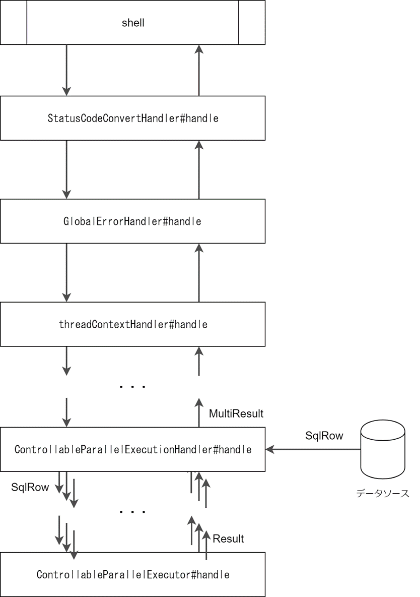

# アーキテクチャ

本ライブラリのアーキテクチャについて記す。

## ハンドラキューの構成

ハンドラキューは次のように構成されている。  
※主要なハンドラ以外は省略している。

- shell の起動によって、`ControllableParallelExecutionHandler#handle` が 1度呼ばれる。
- DB から取得した `SqlRow` 1 行ごとに `ControllableParallelExecutor#handle` が呼ばる。

## `ControllableParallelExecutionHandler#handle`

`ControllableParallelExecutionHandler` の処理のうち、*Akka Streams* を用いて実装したパイプラインの概要を図示する。

### TransactionFlow の責務

- DB Connection をコネクションプールから 1 つ取得する。
- トランザクションを開始する。
- `TransactionFlow` から呼び出す処理（`handle` メソッドの呼び出し）が成功した場合はトランザクションを commit する。
- 処理が失敗した場合はトランザクションを rollback する。
- コネクションを close （コネクションプールに返却）する。
- `handle` メソッドの戻り値（`Result`）を返す（返された `Result` は下流に流される）。

### 並列実行・逐次実行の単位

`ControllableParallelExecutor` では、縦方向の処理の並列化（パイプライン間の並列化）と横方向の処理の並列化（要素間の並列化）を行っている。
横方向の処理の並列化においては、異なる `executionId` の要素（`IN`）は並列で処理される可能性があるが、同一の `executionId` を持つ要素は逐次処理される。
- `DataReaderSource` が DB から要素を取得する処理は下流の処理と並列に処理される（`async` によってパイプラインに非同期境界を設けている）。
- 下流のフローが要素を要求してきた場合、事前に DB から取得し、手元に置いていた値を即座に流せるため、DB との通信にかかるオーバーヘッドが削減できる。
- サブフローはそれぞれ並列に処理される。
- 1 要素（`IN`）ごとに `TransactionFlow` が 1 スレッドにディスパッチされる。
- このスレッドは *Akka* が持つスレッドプールで作られたものである。
- つまり、トランザクションの開始・終了、及び `handle()` の中の処理は 1 スレッドで実行される逐次処理となる。

### `resultSink` の責務
- `TransactionFlow` が返した `Result` を集約し、`MultiResult` に変換する。

### `commitLoggingSink` の責務
- `TransactionFlow` が返した `Result` を元に、コミット回数をロギングする。  
  実際には *Nablarch* の `CommitLogger` に処理を委譲する。

### エラーハンドリング
- `ControllableParallelExecutor#handle` でエラーが起きた（例外が投げられた）場合は、`ErrorResult` に変換される。
- あるサブフローでエラーが起きた場合は、サブフローにある `buffer` からの要素の供給を停止する。
- エラーが起きたサブフローは即座に停止するが、他のサブフローは遅れて停止する可能性がある。
- 最終的には全てのサブフローが停止し、フロー全体が停止する。
- `resultSink` によって集約された `MultiResult` の中に `ErrorResult` が 1 つ以上存在する場合は、その中から最も古い `ErrorResult` を上位ハンドラにエスカレーション（throw）する。
